# 🏗️ E-Commerce Config Server

<div align="center">


</div>

## 📋 Overview

This repository contains the centralized configuration management for our **E-Commerce Microservices Platform** using **Spring Cloud Config Server**. It provides external configuration support for distributed systems, allowing you to manage all environment-specific configurations in one place.

## 🏛️ Architecture Overview

```mermaid
graph TB
    CS[🏗️ Config Server<br/>Port: 8888] 
    ER[🔍 Eureka Registry<br/>Port: 8761]
    
    subgraph "🛍️ E-Commerce Services"
        US[👤 User Service<br/>Port: TBD]
        PS[📦 Product Service<br/>Port: 8082]
        PayS[💳 Payment Service<br/>Port: 8089]
        SS[🚚 Shipping Service<br/>Port: 8082*]
    end
    
    subgraph "📊 Infrastructure"
        PG[(🐘 PostgreSQL<br/>Port: 5432)]
        KF[📨 Apache Kafka<br/>Port: 9092]
    end
    
    CS -.->|Configuration| US
    CS -.->|Configuration| PS
    CS -.->|Configuration| PayS
    CS -.->|Configuration| SS
    
    US --> ER
    PS --> ER
    PayS --> ER
    SS --> ER
    
    PayS --> PG
    SS --> PG
    
    PayS <--> KF
    SS <--> KF
    
    style CS fill:#e1f5fe
    style ER fill:#f3e5f5
    style PG fill:#e8f5e8
    style KF fill:#fff3e0
```



*Note: Shipping Service port conflicts with Product Service - needs adjustment*

## 📁 Configuration Structure

```mermaid
graph LR
    subgraph "📂 config-repo"
        APP[📄 application.yml<br/>Global Config]
        US[📄 user-service.yml<br/>User Service]
        PS[📄 product-service.yaml<br/>Product Service]
        PayS[📄 payment-service.yml<br/>Payment Service]
        SS[📄 shipping-service.yml<br/>Shipping Service]
    end
    
    APP -.->|CORS, Logging, Actuator| ALL[All Services]
    US -.->|User Config| USrv[User Service]
    PS -.->|Product Config| PSrv[Product Service]
    PayS -.->|Payment Config| PaySrv[Payment Service]
    SS -.->|Shipping Config| SSrv[Shipping Service]
```



## 🔧 Configuration Files

### 🌐 Global Configuration (`application.yml`)
- **CORS Policy**: Configured for development with multiple localhost origins
- **Logging**: Debug level for e-commerce and Spring Cloud components
- **Actuator**: Health, info, and refresh endpoints exposed

### 💳 Payment Service (`payment-service.yml`)
```yaml
🏢 Service Details:
  Port: 8089
  Database: payment_system
  
📨 Kafka Topics:
  - payment-created/updated/status-changed/deleted
  - invoice-created/updated/due-date-changed/deleted  
  - transaction-created/updated/status-changed/deleted
```

### 🚚 Shipping Service (`shipping-service.yml`)
```yaml
🏢 Service Details:
  Port: 8082 ⚠️ (Conflicts with Product Service)
  Database: shipping_service
  
🚛 Business Logic:
  - Default Carrier: Standard Shipping
  - Delivery Time: 3 days
  - Base Rate: $10.99
  - Express: 2x multiplier
  - International: 3.5x multiplier
  
📨 Kafka Topics:
  - shipping-created/updated/status-changed/deleted
  - tracking-created/updated/deleted
```

### 📦 Product Service (`product-service.yaml`)
```yaml
🏢 Service Details:
  Port: 8082
  ⚠️ Minimal configuration - needs enhancement
```

### 👤 User Service (`user-service.yml`)
```yaml
❌ Empty configuration file - needs implementation
```

## 🚀 Quick Start

### Prerequisites
- Java 17+
- Spring Boot 3.x
- Spring Cloud Config Server

### 1. Clone the Repository
```bash
git clone <your-config-repo-url>
cd config-repo
```

### 2. Start Config Server
```bash
# In your config server application
./mvnw spring-boot:run
```

### 3. Verify Configuration
```bash
# Test global configuration
curl http://localhost:8888/application/default

# Test service-specific configuration
curl http://localhost:8888/payment-service/default
curl http://localhost:8888/shipping-service/default
```

## ⚠️ Known Issues & Recommendations

### 🔴 Critical Issues
1. **Port Conflict**: Both Product Service and Shipping Service use port `8082`
2. **Empty Configurations**: User Service configuration is completely empty
3. **Security**: Database passwords are in plain text (consider encryption)

### 🟡 Recommendations
1. **Port Assignment**:
   ```yaml
   # Suggested port allocation
   User Service: 8081
   Product Service: 8082  
   Shipping Service: 8083
   Payment Service: 8089
   ```

2. **Environment Profiles**: Add dev/staging/prod profiles
3. **Security**: Implement configuration encryption
4. **Validation**: Add configuration validation schemas

## 🔄 Event-Driven Communication


## 📊 Service Dependencies


## 🏃‍♂️ Development Workflow

1. **Modify Configuration**: Update YAML files in this repository
2. **Commit Changes**: Push to version control
3. **Refresh Services**: Use `/actuator/refresh` endpoint or restart services
4. **Verify Changes**: Check service behavior with new configuration

## 🤝 Contributing

1. Follow YAML best practices
2. Validate configuration syntax before committing
3. Update this README when adding new services
4. Use environment-specific profiles for different deployment stages

## 📞 Support

For configuration issues or questions:
- Check Spring Cloud Config documentation
- Verify YAML syntax
- Ensure service names match configuration file names
- Test configuration endpoints before deploying

---

<div align="center">

**Made with ❤️ for E-Commerce Platform**

</div>
